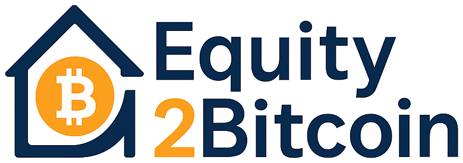

<p align="center">
  
</p>

<h1 align="center">Equity2Bitcoin</h1>

<p align="center">
  <strong>Equity isn’t wealth until it moves.</strong><br />
  Educational consulting that helps homeowners understand how to unlock dormant home equity<br />
  and reposition part of it into self-custodied Bitcoin — without handing anyone their money or their keys.
</p>

<p align="center">
  <a href="https://equity2bitcoin.com">equity2bitcoin.com</a>
  ·
  Equity2Bitcoin Consulting LLC
</p>

---

## The goal

American homeowners sit on trillions in home equity. Most of it is inert — real on paper, unused in practice. At the same time, a growing number of households want long-horizon exposure to Bitcoin and find that banks, brokers, and conventional advisers will not walk them through the mechanics of doing it carefully.

**Equity2Bitcoin exists to close that gap with education first.**

We help homeowners:

1. See what equity is actually *borrowable* (not just what shows on a balance sheet)
2. Understand the real cost of extraction — fees, carry, foreclosure risk, Bitcoin volatility
3. Prepare a lender-ready path they execute themselves
4. Learn self-custody so proceeds never need to touch a middleman

We do **not** lend, broker loans, manage assets, take custody, or sell price promises. Every financial decision stays with the homeowner and their own licensed professionals.

---

## Business model

The engagement is a **five-milestone consulting path**. Four milestones are free. One is paid.

| Phase | What happens | Fee |
|---|---|---|
| **1 — Equity Profile Review** | Map the equity position, explain HELOC / cash-out options, deliver a readiness report | No fee |
| **2 — Loan Preparation** | Documentation checklists and underwriting education for a licensed lender the client chooses | No fee |
| **3 — Loan Approval & Funding** | Milestone verified when the lender funds the extraction | **30% of equity extracted** |
| **4 — Bitcoin & Custody Education** | Exchange onboarding, wallet hygiene, long-horizon holding education — client executes every transaction | No fee |
| **5 — Verification & Close** | Closing packet and acknowledgment that the engagement was educational and non-custodial | No fee |

### How the fee works

- Charged **once**, only at Phase 3, on **verified equity extracted**
- **Not** tied to Bitcoin performance, AUM, or custody
- If the loan never funds, the success fee never invoices
- Less than the draw reaches Bitcoin — the fee comes out of the proceeds, and payments are still owed on the full advance

That last point is intentional product honesty. The site calculator shows the subtraction on purpose: borrowable equity → milestone fee → net to Bitcoin → illustrative carry cost.

### What we are not

Not a bank. Not a mortgage broker. Not a registered investment adviser. Not a custodian or money transmitter. Clients apply to licensed lenders independently and hold their own keys.

---

## This repository

This repo is the **commercial conversion site** for Equity2Bitcoin — the public face of the funnel:

1. **Hero calculator** — run LTV-aware numbers immediately  
2. **Equity IQ + fit checks** — qualify honestly, including “can you pay if BTC −80%?”  
3. **Transparent fee story** — worked examples with fee-before-BTC math  
4. **Book orientation** — acknowledgment gate, then Calendly or fallback lead form  
5. **Legal pages** — terms, privacy, disclosures  

Supporting docs:

- [`docs/SITE.md`](./docs/SITE.md) — local launch, env vars, funnel notes  
- [`docs/LEGAL-REVIEW.md`](./docs/LEGAL-REVIEW.md) — counsel checklist before pointing a live consumer domain  
- [`docs/Equity2Bitcoin_Business_Plan.pdf`](./docs/Equity2Bitcoin_Business_Plan.pdf) — planning source document  

---

## Tech stack

A focused frontend, intentionally small.

| Layer | Choice |
|---|---|
| UI | React 18 + TypeScript |
| Bundler | Vite 6 |
| Routing | React Router 7 |
| Styling | Hand-tuned global CSS (Instrument Serif + Manrope) |
| Hosting | Vercel (`vercel.json` SPA rewrites) |
| Tests | Node native test runner for equity math (`npm test`) |

App sources live under [`web/`](./web/). Tunables (fee rate, BTC reference scenarios, calculator defaults) live in [`web/src/config/site.ts`](./web/src/config/site.ts).

### Local development

```bash
npm install
npm run dev
```

Open [http://localhost:5173](http://localhost:5173).

| Command | Purpose |
|---|---|
| `npm run dev` | Local Vite server |
| `npm run build` | Typecheck + production build → `dist/` |
| `npm run preview` | Preview the production build |
| `npm run typecheck` | TypeScript only |
| `npm test` | Equity / LTV math unit tests |

---

## Connectivity & integrations

The site is built to stay useful **before** every SaaS account is wired — and to get sharper as those tools come online.

### Ready today

| Integration | Status | How |
|---|---|---|
| **Calendly** | Hooked up via env | Set `VITE_CALENDLY_URL` to your orientation event URL. Booking embeds inline after the acknowledgment gate. |
| **Lead webhook** | Optional | Set `VITE_LEAD_WEBHOOK_URL` (Zapier / Make / HubSpot / custom). Equity IQ + orientation form posts JSON there. |
| **Fallback form** | Built-in | If Calendly is unset, `/book` still captures leads to `sessionStorage` and the webhook when present. |

Copy `web/.env.example` → `web/.env` (or set the same keys in Vercel):

```bash
VITE_CALENDLY_URL=https://calendly.com/your-org/orientation-20min
VITE_LEAD_WEBHOOK_URL=https://hooks.zapier.com/...
```

### Natural next connections

These are the obvious extensions once the orientation pipeline is live:

- **Calendly routing** — separate orientation vs. Equity Profile Review events  
- **CRM** — HubSpot / Close / Attio for quiz band, calculator context, and follow-ups  
- **DocuSign / PandaDoc** — Milestone Agreement after a qualified call  
- **Email** — transactional confirmations + nurture that stays education-first  
- **Analytics** — privacy-conscious funnel metrics (quiz completion → book → show)  
- **SMS reminders** — optional Calendly-native or Twilio for orientation no-shows  

None of those are required to ship the site. The core loop — **honest numbers → qualified interest → booked conversation** — already runs end to end.

---

## Product principles (encoded in the UI)

- **Paper equity ≠ borrowable equity** — LTV caps are first-class in the calculator  
- **Fee before fantasy** — net-to-Bitcoin is shown before any illustrative BTC quantity  
- **Volatility up front** — drawdowns and foreclosure risk are not buried in footnotes only  
- **Disqualify openly** — `/fit` and Equity IQ will tell someone this path is wrong for them  
- **Education, not advice** — booking requires an explicit acknowledgment of that boundary  

---

## License & legal

Private project — all rights reserved unless otherwise noted.

This software and the public site make consumer-facing claims about a fee arrangement tied to home-equity borrowing and digital assets. **Do not point a live consumer domain at a deploy until counsel has reviewed [`docs/LEGAL-REVIEW.md`](./docs/LEGAL-REVIEW.md).**

---

<p align="center">
  <em>Educate first. Advise never. Empower always.</em>
</p>
